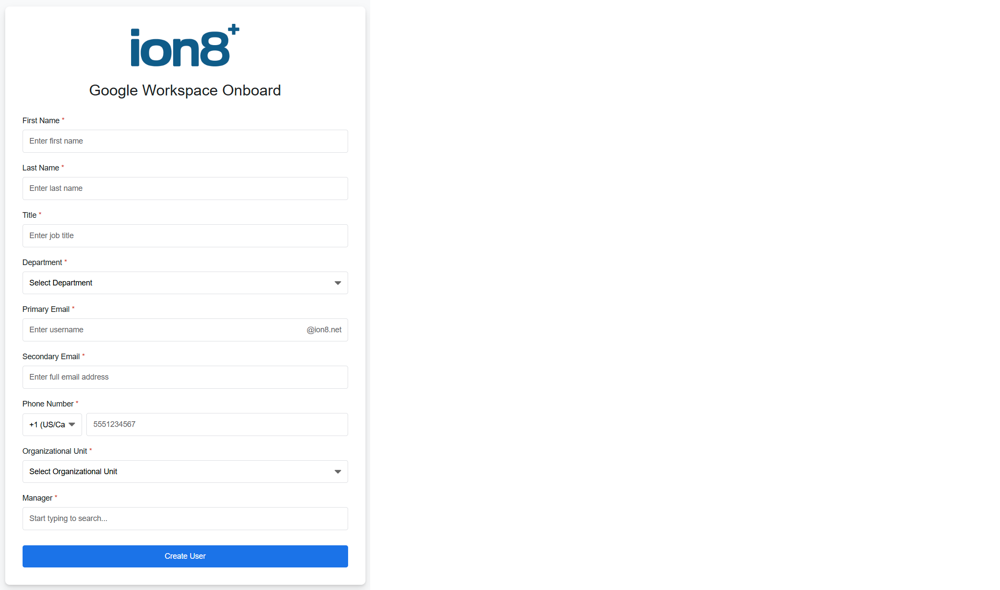

# Google Workspace User Onboarding Form

A web-based user onboarding tool for Google Workspace administrators built with Google Apps Script.

<p align="center">
  
</p>

## Features

- ✅ **User-friendly web form** with modern Material Design UI
- 🔍 **Manager autocomplete** with live search functionality
- 📋 **Organizational unit selection** dynamically loaded from Google Workspace
- ✏️ **Client-side validation** for all form fields
- 📱 **International phone number support** with country code dropdown
- 🎯 **Auto-appending email domain** for primary email addresses
- ✨ **Loading animations** and success/error modals
- 🔒 **Super admin requirement** with warning banner

## Requirements

- Google Workspace account with **Super Admin** privileges
- Access to Google Apps Script
- Admin SDK Directory API enabled

## Installation

### Step 1: Create Google Apps Script Project

1. Go to [script.google.com](https://script.google.com)
2. Click **New Project**
3. Give your project a name (e.g., "Workspace Onboarding")

### Step 2: Add the HTML File

1. In your Apps Script project, click **+** next to Files
2. Select **HTML**
3. Name it `Index` (or any name you prefer)
4. Copy the contents of `google-workspace-onboard.html` into this file

### Step 3: Create the Backend Script

1. In your Apps Script project, open `Code.gs`
2. Add the backend functions (see Backend Functions section below)

### Step 4: Configure for Your Organization

Update the following in the HTML file:

1. **Line 402**: Replace the logo URL
   ```html
   
   ```

2. **Line 449**: Update the email domain suffix
   ```html
   <span class="email-suffix">@yourdomain.com</span>
   ```

3. **Line 420-427**: Customize department options
   ```html
   <option value="Marketing">Marketing</option>
   <option value="Sales">Sales</option>
   <!-- Add your departments here -->
   ```

4. **Line 755**: Update email domain in auto-append function
   ```javascript
   this.value = this.value + '@yourdomain.com';
   ```

### Step 5: Deploy as Web App

1. Click **Deploy** > **New deployment**
2. Select type: **Web app**
3. Configuration:
   - **Execute as**: Me
   - **Who has access**: Anyone within your organization
4. Click **Deploy**
5. Copy the web app URL

### Step 6: Enable Admin SDK

1. In Apps Script editor, click **Services** (+)
2. Find and add **Admin SDK API**
3. Click **Add**

## Backend Functions Required

You'll need to create these functions in your `Code.gs` file:

```javascript
/**
 * Serve the HTML interface
 */
function doGet() {
  return HtmlService.createHtmlOutputFromFile('Index')
    .setTitle('Google Workspace Onboard')
    .setXFrameOptionsMode(HtmlService.XFrameOptionsMode.ALLOWALL);
}

/**
 * Get all organizational units
 */
function getOUs() {
  try {
    const ous = AdminDirectory.Orgunits.list('my_customer', {
      type: 'all'
    }).organizationUnits;
    
    return ous.map(ou => ({
      name: ou.name,
      orgUnitPath: ou.orgUnitPath
    }));
  } catch (error) {
    throw new Error('Failed to fetch OUs: ' + error.message);
  }
}

/**
 * Get all users for manager autocomplete
 */
function getAllUsers() {
  try {
    const users = [];
    let pageToken;
    
    do {
      const response = AdminDirectory.Users.list({
        customer: 'my_customer',
        maxResults: 500,
        pageToken: pageToken,
        projection: 'basic',
        query: 'isSuspended=false'
      });
      
      if (response.users) {
        response.users.forEach(user => {
          users.push({
            name: user.name.fullName,
            email: user.primaryEmail
          });
        });
      }
      
      pageToken = response.nextPageToken;
    } while (pageToken);
    
    return users;
  } catch (error) {
    throw new Error('Failed to fetch users: ' + error.message);
  }
}

/**
 * Create a new user in Google Workspace
 */
function createUser(formData) {
  try {
    // Validate super admin status
    const currentUser = Session.getActiveUser().getEmail();
    const userInfo = AdminDirectory.Users.get(currentUser);
    
    if (!userInfo.isAdmin || !userInfo.isSuperAdmin) {
      throw new Error('Only super admins can create users');
    }
    
    // Generate temporary password
    const tempPassword = generatePassword();
    
    // Create user object
    const user = {
      name: {
        givenName: formData.firstName,
        familyName: formData.lastName
      },
      primaryEmail: formData.email,
      password: tempPassword,
      changePasswordAtNextLogin: true,
      orgUnitPath: formData.ou,
      organizations: [{
        title: formData.title,
        department: formData.department,
        primary: true
      }],
      phones: [{
        type: 'work',
        value: formData.phoneNumber,
        primary: true
      }],
      recoveryEmail: formData.secondaryEmail
    };
    
    // Add manager relation if provided
    if (formData.manager) {
      user.relations = [{
        type: 'manager',
        value: formData.manager
      }];
    }
    
    // Create the user via Admin SDK
    const createdUser = AdminDirectory.Users.insert(user);
    
    // Optional: Send welcome email
    sendWelcomeEmail(createdUser.primaryEmail, formData.firstName, tempPassword);
    
    return {
      success: true,
      user: {
        name: createdUser.name.fullName,
        email: createdUser.primaryEmail,
        department: formData.department,
        title: formData.title,
        manager: formData.manager,
        managerName: formData.managerName
      }
    };
    
  } catch (error) {
    Logger.log('Error creating user: ' + error);
    throw new Error('Failed to create user: ' + error.message);
  }
}

/**
 * Generate a random password
 */
function generatePassword() {
  const length = 16;
  const charset = 'abcdefghijklmnopqrstuvwxyzABCDEFGHIJKLMNOPQRSTUVWXYZ0123456789!@#$%^&*';
  let password = '';
  
  for (let i = 0; i < length; i++) {
    password += charset.charAt(Math.floor(Math.random() * charset.length));
  }
  
  return password;
}

/**
 * Send welcome email to new user (optional)
 */
function sendWelcomeEmail(email, firstName, tempPassword) {
  const subject = 'Welcome to [Your Company Name]';
  const body = `
    Hi ${firstName},
    
    Your Google Workspace account has been created!
    
    Email: ${email}
    Temporary Password: ${tempPassword}
    
    Please change your password upon first login.
    
    Best regards,
    IT Team
  `;
  
  try {
    MailApp.sendEmail(email, subject, body);
  } catch (error) {
    Logger.log('Failed to send welcome email: ' + error);
  }
}
```

## Usage

1. Share the web app URL with your HR team or administrators
2. Users fill out the form with new employee information
3. Click "Create User" to provision the account
4. Success modal displays the created user details
5. New user receives a welcome email (if configured)

## Form Fields

| Field | Required | Description |
|-------|----------|-------------|
| First Name | Yes | Employee's first name (max 30 chars) |
| Last Name | Yes | Employee's last name (max 30 chars) |
| Title | Yes | Job title (max 30 chars) |
| Department | Yes | Select from dropdown |
| Primary Email | Yes | Username only, domain auto-appended |
| Secondary Email | Yes | Recovery/personal email address |
| Phone Number | Yes | With country code, 7-12 digits |
| Organizational Unit | Yes | Selected from workspace OUs |
| Manager | Yes | Search by name or email |

## Security Notes

- Only **Super Admins** can create users
- Form validates admin status before user creation
- Temporary passwords are randomly generated (16 characters)
- Users must change password on first login
- All API calls are server-side for security

## Customization

### Add Custom Fields

To add custom fields to the user object:

1. Add the form field in the HTML
2. Update the `formData` object in the submit handler
3. Modify the `createUser` function to include the new field

### Styling

The form uses Google Material Design principles. Colors and styles can be customized in the `<style>` section.

### Email Templates

Customize the welcome email in the `sendWelcomeEmail` function.

## Troubleshooting

### "Only super admins can use this tool"
- Ensure you're logged in with a Super Admin account
- Check that Admin SDK is enabled in your project

### "Failed to load OUs"
- Verify Admin SDK API is added to your project
- Check that the script has proper permissions
- Try re-deploying the web app

### Manager autocomplete not working
- Ensure `getAllUsers()` function is implemented
- Check browser console for JavaScript errors
- Verify users exist in your workspace

### User creation fails
- Check Apps Script execution logs for errors
- Verify all required fields are filled
- Ensure email address isn't already in use
- Confirm organizational unit path is valid

## License

MIT License - Feel free to modify and use for your organization.

## Support

For issues or questions, check the [Google Apps Script documentation](https://developers.google.com/apps-script) or [Admin SDK documentation](https://developers.google.com/admin-sdk).
